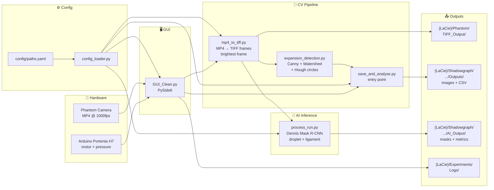
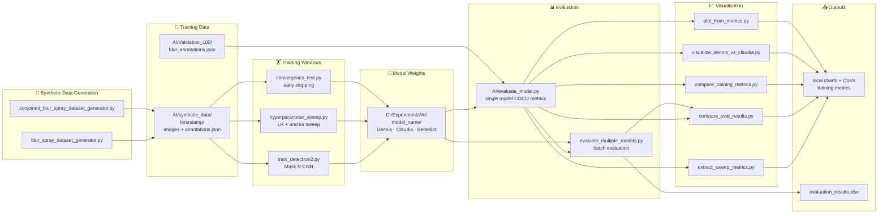
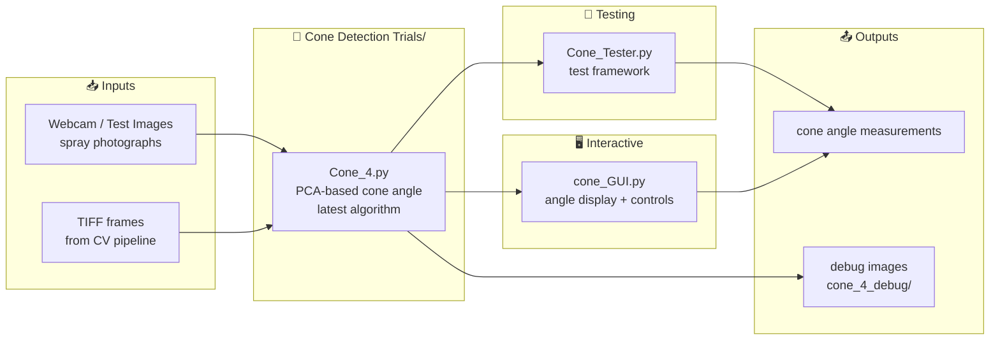

<!-- Merge term 1 -->
# HPATR System Flowcharts

Paste each code block into [mermaid.live](https://mermaid.live) to render, or view on GitHub.
For Notion: `/code` block → set language to **Mermaid** → paste.

---

## 1 — Experiment Pipeline

---

## 2 — AI Training Pipeline

---

## 3 — Cone Detection Pipeline

